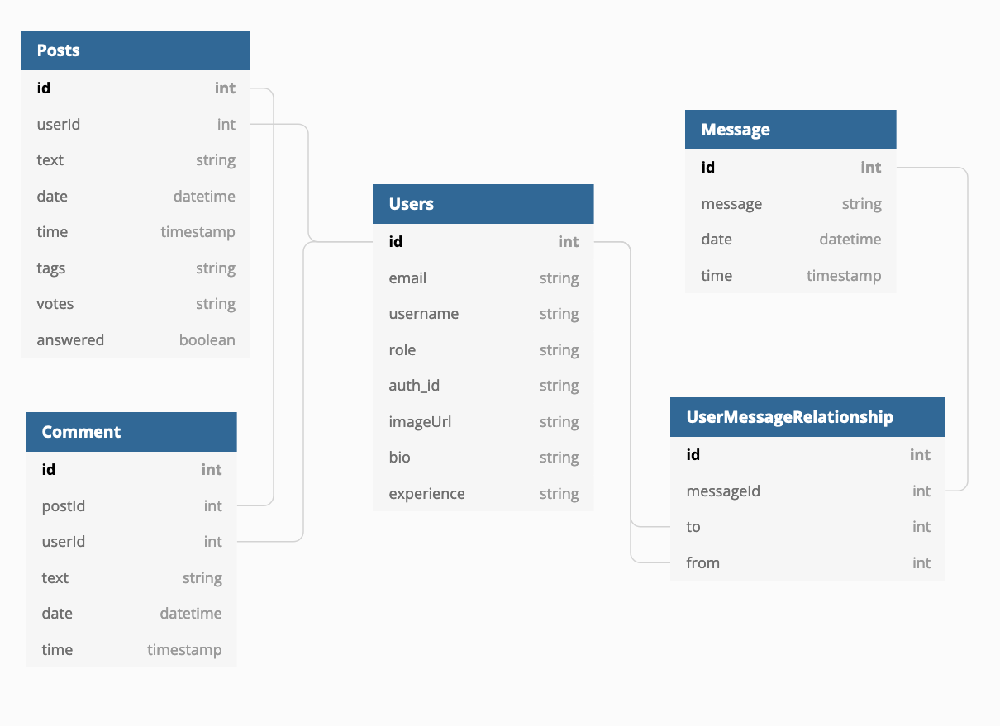

##  Code💻Coach

Code Coach is a react-app hoping to create a new way to connect developers. We hoped to create a platform where one can build a mentee and mentor relationship between a junior and senior developer. This is created by students at [EDA](https://devacademy.co.nz/) as a final project to showcase within 1 week.

<p align="center">

</p>

### Installation

1. Clone the repo
   ```sh
   git clone https://github.com/Pohutukawa-2021/CodeCoach.git
   ```
2. Install NPM packages
   ```sh
   npm install
   ```
3. Run migrate and seed to create a mock database
   ```sh
   npm run migrate
   ```
4. See it in action
   ```sh
   npm run dev
   ```
   You can find the server running on http://localhost:3000/
   
### Authentication
User authentication is handled by [Auth0](https://auth0.com/)

### Built With
* [Socket.io](https://socket.io/)
* [Gifted-chat](https://www.npmjs.com/package/react-native-gifted-chat)

### ERD / Planning / Execution

<p align="center">

</p>

The diagram above shows the current schema of our database. 

See the open issues for a list of proposed features (and known issues) in our
 [Board](https://codecoach.atlassian.net/jira/software/projects/COD/boards/1) in Jira.

### Design
See our wireframe created in [Figma](https://www.figma.com/file/SxGE4mFQvjWyawG9Jbwmh4/dev-academy?node-id=341%3A39)

### Deployment
[The Code Coach](thecodecoach.herokuapp.com) <br>
This project has been deployed to Heroku. 
### License
Distributed under the MIT License. See `LICENSE` for more information.

### Brought to you by:
- [Louis Lising](https://github.com/LouisDVL) / [LinkedIn](https://www.linkedin.com/in/louis-lising-8b9623187/)
- [Prabhnoor Singh](https://github.com/Prabhnoor-2001) / [LinkedIn](https://www.linkedin.com/in/prabhnoor-singh-8804b521a/)
- [Dianne Plaza](https://github.com/dianneplz) / [LinkedIn](https://www.linkedin.com/in/dianne-plaza-848915180/)
- [Caleb Perrett](https://github.com/caleb-perrett) / [LinkedIn](https://www.linkedin.com/in/caleb-perrett-60b12ab1/)
- [Alan Cheng](https://github.com/nzalancheng) / [LinkedIn](https://www.linkedin.com/in/alan-cheng-b68186141/)
